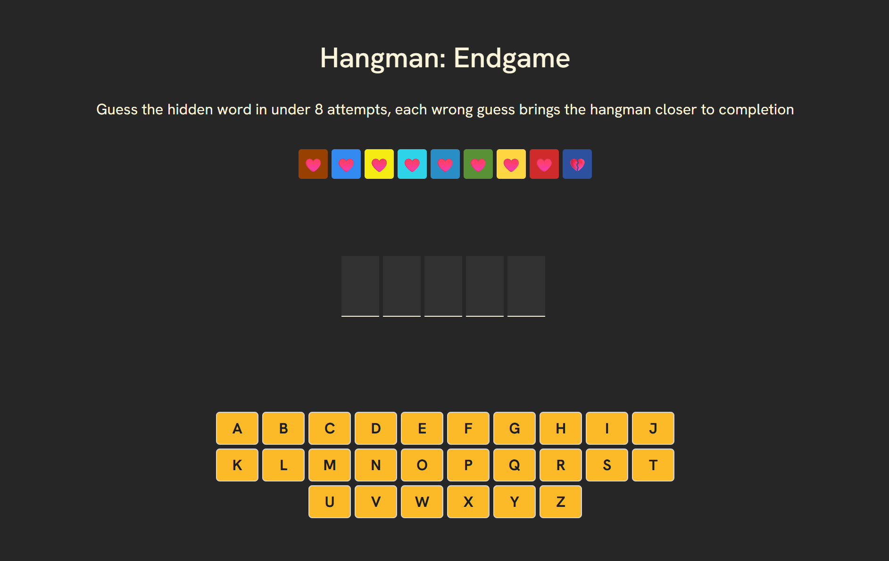

# Hangman

A classic Hangman word-guessing game built with React.

## About

Hangman is a single-player word-guessing game where the player attempts to reveal a hidden word by suggesting letters, one at a time. Each incorrect guess draws another part of the hangman figure. The player wins by guessing the word before the figure is fully drawn.

## Features

- Interactive on-screen keyboard
- Animated hangman figure drawn on each wrong guess
- Random word selection from a curated word list
- Win/loss detection with restart option
- Responsive design for desktop and mobile

## Tech Stack

- **React** — UI components and state management
- **CSS Modules** — scoped, modular styling
- **Vite** — fast development server and build tool
